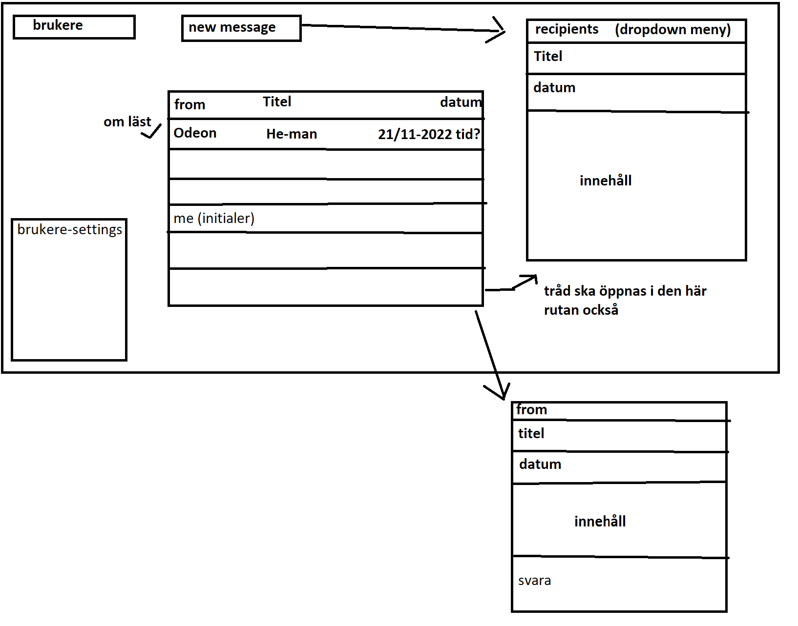

# PG209 Backend programming exam

Link to Azure Websites Deployment: https://pg209exam-sg-tl-tobia.azurewebsites.net/

#### Feature list:
 * Our chat is demonstrated on a single page (frontend).
   * Able to create a new user - page updates automatically to refresh.
   * List of all users in a drop-down menu.
     - Choose who to login as. Information about the current user will show above the menu.
   
   * After logging in you can:
     - Change user settings.
       - Full name: Must include at least 2 names (first name and last name).
       - E-mail: Must include an @ between name and domain (can have multiple names/domains). For example pgr.209@student.kristiania.no or hello@hello.com
       - Age: Must be over 0.
       - Color: Must input a real color.
         - Input control is made in the DAO (UserDao).
           - Does nothing if fields are empty. 
           - Regex control for name and email.
           - Cant use a duplicate email.
     
   * See all conversations (message threads)
     - When selecting a conversation:
       - A box will appear to all participants (we chose to exclude the current user to show for him/herself since it felt redundant).
       - All messages will appear.
       - At the bottom, it is possible to reply to the conversation.
         - The message itself will appear directly. But to see your name and date of the message in the conversation, you have to refresh/change thread, for it to appear.
       
   * Create new conversation
     - To the right, it is possible to create a new conversation.
       - First you need to enter the conversation title (this generates the ID of the conversation that is used to add recipients in next part).
       - Then you can add recipients to the conversation.
       - Lastly, write a message for the conversation.
       - When a conversation is created, the page will refresh.
       - Everyone added can see and reply to the conversation.

Our final database UML-diagram

Our very rough design of how we planned for it to look like, which held pretty good.

#### Teamwork
We started with doing a lot of planning for how the project would look like.
We planned out a very rough sketch that held all the way.
The database UML-diagram was changed multiple times (we kept everything in resources on root).

Most work has been together either meeting up or on discord, doing pair programming. Only some minor work was planned and divided between us.
Through the whole project, we have basically discussed everything with each other to avoid misunderstandings, so we knew how to proceed.

## Sjekkliste for innleveringen

* [x] Dere har lest eksamensteksten
* [x] Koden er sjekket inn på github.com/pg209-2022 repository
* [x] Dere har lastet opp en ZIP-fil lastet ned fra Github
* [x] Dere har committed kode med begge prosjektdeltagernes GitHub-konto (alternativt: README beskriver hvordan dere har jobbet)

## README.md

* [x] Inneholder link til Azure Websites deployment
* [x] Inneholder en korrekt badge til GitHub Actions
* [x] Beskriver hva dere har løst utover minimum
* [x] Inneholder et diagram over databasemodellen

## Koden

* [x] Oppfyller Java kodestandard med hensyn til indentering og navngiving
* [x] Er deployet korrekt til Azure Websites
* [x] Inneholder tester av HTTP og database-logikk
* [x] Bruker Flyway DB for å sette opp databasen
* [x] Skriver ut nyttige logmeldinger

## Basisfunksjonalitet

* [x] Kan velge hvilken bruker vi skal opptre som
* [x] Viser eksisterende meldinger til brukeren
* [x] Lar brukeren opprette en ny melding
* [x] Lar brukeren svare på meldinger
* [x] For A: Kan endre navn og annen informasjon om bruker
* [x] For A: Meldingslisten viser navnet på avsender og mottakere

## Kvalitet

* [x] Datamodellen er *normalisert* - dvs at for eksempel navnet på en meldingsavsender ligger i brukertallen, ikke i meldingstabellen
* [x] Når man henter informasjon fra flere tabellen brukes join, i stedet for 1-plus-N queries (et for hovedlisten og et per svar for tilleggsinformasjon)
* [x] Det finnes test for alle JAX-RS endpoints og alle DAO-er

